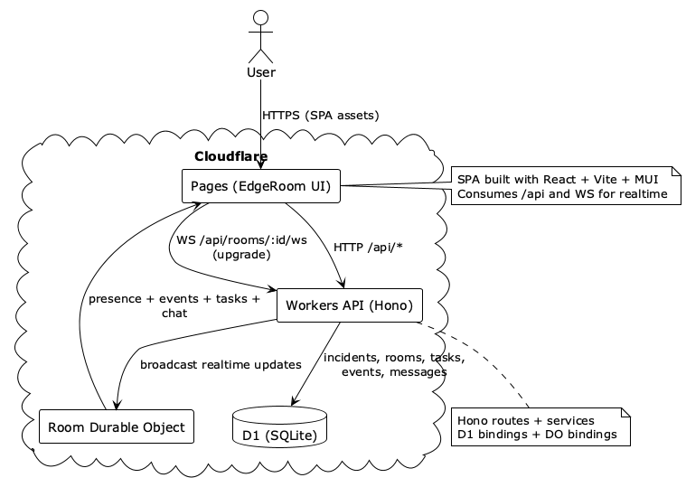

# EdgeRoom: Realtime Incident Rooms
EdgeRoom is a realtime incident war-room built on Cloudflare Workers + Durable Objects.
Teams can spin up an incident room, coordinate via live chat, track tasks/events, and review incident detail timelines.

## What it does (current flow)

1. **Dashboard** (`/`)
   - Lists incidents with status (open/resolved).
   - Create a new incident or generate a demo incident.
   - Click an incident key to see detailed context.

2. **Incident Detail** (`/incidents/:incidentKey`)
   - Shows summary, linked room, and a combined timeline of events + tasks.
   - Mark incident as resolved.

3. **Room** (`/rooms/:roomId`)
   - Live chat with presence.
   - Tasks and events shown in a left pane.
   - Convert any chat message to a task or event.

## Tech stack

- **Frontend**: React + TypeScript + Vite + MUI
- **State**: React Query (HTTP) + useReducer (room realtime state)
- **Backend**: Cloudflare Workers + Hono
- **Realtime**: Durable Objects + WebSocket
- **Storage**: Cloudflare D1 (SQLite)

## High-level architecture

See `edgeroom/architecture.puml` for the deployment diagram.



## Key behaviors

- **Hydration first**: Room state is loaded via HTTP `/api/rooms/:id/state`.
- **Realtime after**: WebSocket deltas update reducer state.
- **Chat persistence**: Messages are stored in D1 and broadcast via DO.
- **Incidents**: `incident_rooms` mapping ties incident keys to rooms.

## Local dev (quick)

```bash
# Worker
cd ${WORKSPACE_BASE}/apps/worker
wrangler dev --env local

# Web
cd ${WORKSPACE_BASE}/apps/web
npm install
npm run dev
```
## Prod deploy (quick)

This is wired via GitHub integration (main branch)

## Notes

- Pages uses `VITE_API_BASE` and `VITE_WS_ORIGIN` in production.
- D1 migrations are required before local/remote use.
  ```bash
  # remote 
  cd ${WORKSPACE_BASE}/apps/worker
  wrangler d1 migrations apply incident-room-db --env prod --remote

  # local
  cd ${WORKSPACE_BASE}/apps/worker
  wrangler d1 migrations apply incident-room-db --env local --local
  ```
